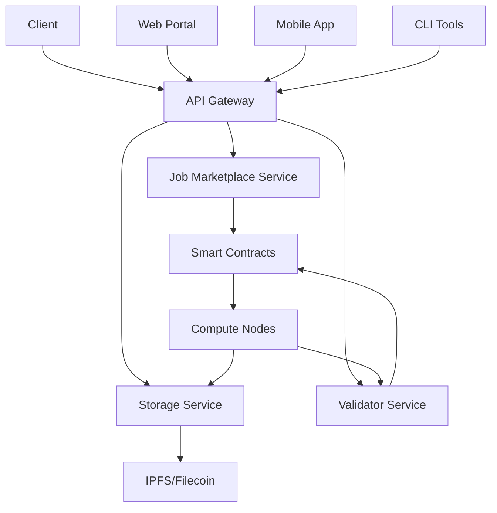
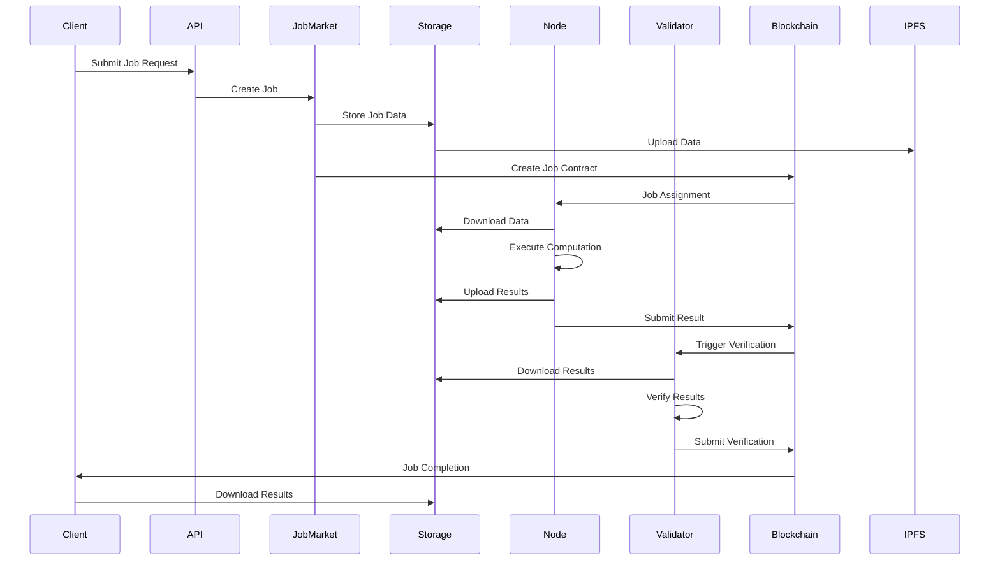
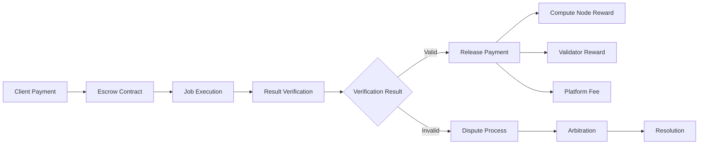
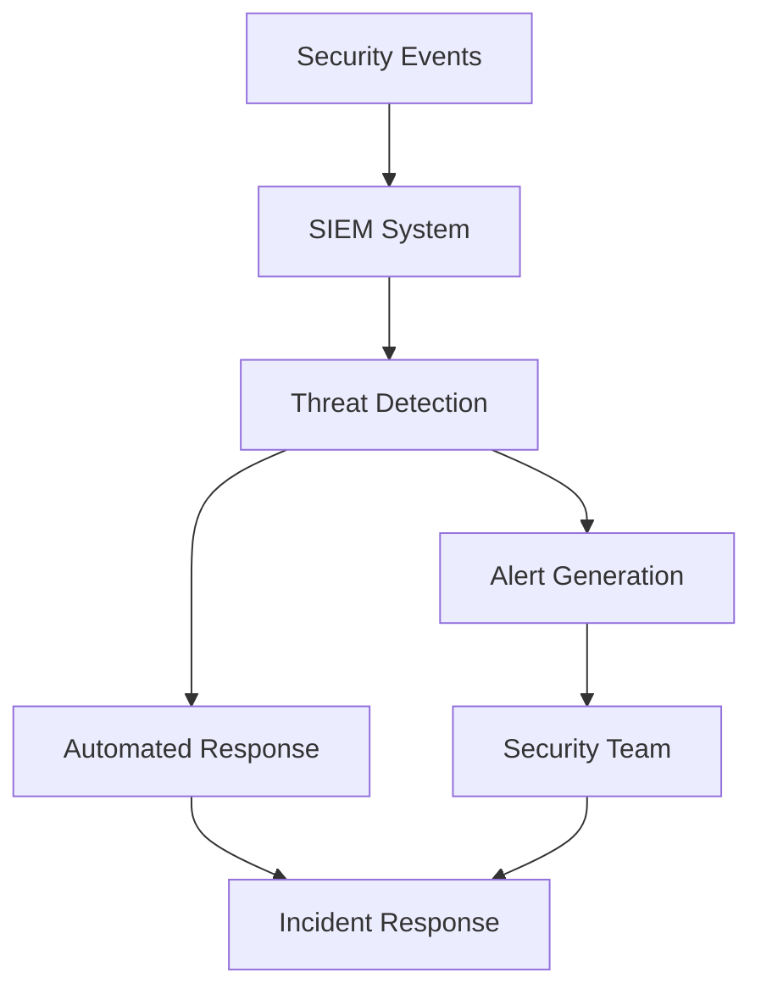

# VFT Platform - Next-Generation AI Mining Architecture

## Table of Contents
1. [Overview](#overview)
2. [Revolutionary Architecture](#revolutionary-architecture)
3. [Quantum-Enhanced Computing](#quantum-enhanced-computing)
4. [Advanced Component Details](#advanced-component-details)
5. [Terabyte Data Flow](#terabyte-data-flow)
6. [Multi-Chain Integration](#multi-chain-integration)
7. [Self-Evolving Platform](#self-evolving-platform)
8. [Enterprise-Grade Security](#enterprise-grade-security)
9. [Implementation Status](#implementation-status)

## Overview

The VFT Platform is a **next-generation quantum-enhanced AI mining network** that processes terabyte-scale datasets using hybrid quantum-classical computing. Unlike traditional platforms, VFT combines quantum computing, self-evolving AI agents, and multi-chain interoperability to create the world's most advanced decentralized AI infrastructure.

### Revolutionary Principles

- **Quantum-Enhanced Computing**: Automatic quantum advantage detection for exponential speedups
- **Terabyte-Scale Processing**: Handle datasets up to 1TB+ with distributed computing
- **Self-Evolving Platform**: AI agents continuously optimize and improve the system
- **Multi-Chain Universal**: Seamless operation across 7+ blockchain networks
- **Real-Time Everything**: Zero hardcoded values - all metrics from live system state
- **No Registration Required**: Instant access for users and miners with heartbeat monitoring

## Revolutionary Architecture

### Next-Generation AI Mining Architecture

```
┌─────────────────────────────────────────────────────────────────┐
│                AI Mining Client Interfaces                     │
│  ┌─────────────┬─────────────┬─────────────┬─────────────┐     │
│  │User Platform│Miner Platform│Public Site │ Admin       │     │
│  │Terabyte Jobs│Real-time AI │(No Launch) │Dashboard    │     │
│  │Session Mgmt │Mining       │Info Only   │             │     │
│  └─────────────┴─────────────┴─────────────┴─────────────┘     │
└─────────────────────────────────────────────────────────────────┘
                               │
                               ▼
┌─────────────────────────────────────────────────────────────────┐
│              Multi-Chain Client SDKs                           │
│  ┌─────────────┬─────────────┬─────────────┬─────────────┐     │
│  │ Python SDK  │JavaScript   │ Rust SDK    │Multi-Chain  │     │
│  │AI Research  │Web3 dApps   │High-Perf    │Integration  │     │
│  └─────────────┴─────────────┴─────────────┴─────────────┘     │
└─────────────────────────────────────────────────────────────────┘
                               │
                               ▼
┌─────────────────────────────────────────────────────────────────┐
│              Advanced API Gateway                              │
│  • Session Management & Heartbeat Monitoring                  │
│  • Terabyte Processing & Chunked Uploads                      │
│  • Multi-Chain Authentication & Payments                      │
│  • Real-time WebSocket & Dynamic Stats                        │
└─────────────────────────────────────────────────────────────────┘
                               │
        ┌──────────────────────┼──────────────────────┐
        ▼                      ▼                      ▼
┌─────────────────┐ ┌─────────────────┐ ┌─────────────────┐
│Quantum-Classical│ │Terabyte Storage │ │AGI Integration  │
│Hybrid Layer     │ │Service          │ │Layer           │
│                 │ │                 │ │                 │
│• Quantum Detect │ │• IPFS/Filecoin  │ │• Self-Evolution │
│• IBM/AWS/Azure  │ │• Torrent/Chunk  │ │• AI Agents      │
│• Circuit Gen    │ │• 1TB+ Support   │ │• Code Gen       │
│• Hybrid Merge   │ │• Multi-delivery │ │• Optimization   │
└─────────────────┘ └─────────────────┘ └─────────────────┘
                               │
                               ▼
┌─────────────────────────────────────────────────────────────────┐
│              Cross-Chain Interoperability                      │
│  ┌─────────────┬─────────────┬─────────────┬─────────────┐     │
│  │Ethereum/EVM │Solana/SPL   │Cosmos/IBC   │Polkadot/XCM│     │
│  │Token Bridge │Primary Chain│Universal    │Parachain   │     │
│  │Smart Contracts│Native VFT │Compute     │Integration  │     │
│  └─────────────┴─────────────┴─────────────┴─────────────┘     │
└─────────────────────────────────────────────────────────────────┘
                               │
                               ▼
┌─────────────────────────────────────────────────────────────────┐
│            Quantum-Enhanced Mining Network                     │
│  ┌─────────────┬─────────────┬─────────────┬─────────────┐     │
│  │GPU Miners   │Quantum      │Edge Compute │Data Centers │     │
│  │AI Processing│Processors   │Distributed  │Enterprise   │     │
│  │             │IBM/AWS/Azure│Mobile/IoT   │Dedicated    │     │
│  │• Heartbeat  │• QAOA/QML   │• Real-time  │• High-Scale │     │
│  │• Session    │• Hybrid     │• Heartbeat  │• Multi-GPU  │     │
│  │• Multi-Chain│• Simulation │• Session    │• Professional│     │
│  └─────────────┴─────────────┴─────────────┴─────────────┘     │
└─────────────────────────────────────────────────────────────────┘
```

### Component Interaction Flow



## Component Details

### 1. Smart Contracts Layer

#### VFT Token Contract (`/contracts/programs/vft-token/`)
- **Purpose**: ERC-20 compatible utility token with platform-specific features
- **Key Functions**:
  - Token minting and burning
  - Staking and unstaking
  - Reward distribution
  - Fee collection
- **Implementation**: Solana program with SPL token integration

#### Job Marketplace Contract (`/contracts/programs/job-marketplace/`)
- **Purpose**: Manages the lifecycle of AI computation jobs
- **Key Functions**:
  - Job posting and bidding
  - Node assignment and matching
  - Payment escrow and release
  - Status tracking and updates
- **Integration**: Links with staking and reputation contracts

#### Staking Contract (`/contracts/programs/staking/`)
- **Purpose**: Manages node staking and economic security
- **Key Functions**:
  - Stake deposits and withdrawals
  - Slashing for malicious behavior
  - Reward calculation and distribution
  - Delegation and validator selection

#### Governance Contract (`/contracts/programs/governance/`)
- **Purpose**: Decentralized platform governance
- **Key Functions**:
  - Proposal creation and voting
  - Parameter updates
  - Treasury management
  - Upgrade mechanisms

#### Reputation Contract (`/contracts/programs/reputation/`)
- **Purpose**: Tracks and manages participant reputation
- **Key Functions**:
  - Performance scoring
  - Reputation updates
  - Penalty application
  - Validator selection weighting

#### Verification Contract (`/contracts/programs/verification/`)
- **Purpose**: Implements PoUAW verification logic
- **Key Functions**:
  - Result submission and validation
  - Consensus mechanisms
  - Dispute resolution
  - Verification strategy selection

### 2. Microservices Layer

#### API Gateway (`/api-gateway/`)
- **Technology**: Python/FastAPI
- **Responsibilities**:
  - Request authentication and authorization
  - Rate limiting and quota management
  - Service discovery and load balancing
  - API documentation and versioning
- **Key Files**:
  - `src/main.py`: Main application entry point
  - `src/auth.py`: Authentication logic
  - `src/rate_limiting.py`: Rate limiting implementation
  - `src/routing.py`: Service routing logic

#### Storage Service (`/storage-service/`)
- **Technology**: Python/FastAPI with IPFS and Filecoin SDKs
- **Responsibilities**:
  - Data upload and retrieval
  - IPFS pinning and management
  - Filecoin storage deals
  - Data encryption and access control
- **Key Files**:
  - `src/main.py`: Service entry point
  - `src/ipfs_manager.py`: IPFS integration
  - `src/filecoin_manager.py`: Filecoin integration

#### Validator Service (`/validator-service/`)
- **Technology**: Python/FastAPI with ML libraries
- **Responsibilities**:
  - Result verification strategies
  - Consensus coordination
  - Dispute resolution
  - Validator selection and assignment
- **Key Files**:
  - `src/main.py`: Service entry point
  - Verification strategy implementations

### 3. Node Software (`/node-software/`)

#### Core Components
- **Technology**: Rust with async runtime (Tokio)
- **Architecture**: Modular design with plugin system

#### Key Modules

##### Configuration Management (`src/config/`)
- **Purpose**: Centralized configuration system
- **Features**:
  - TOML-based configuration files
  - Environment variable overrides
  - Runtime configuration updates
  - Hardware auto-detection

##### Execution Engine (`src/executor/`)
- **Purpose**: AI computation execution
- **Features**:
  - Multi-framework support (PyTorch, TensorFlow, ONNX)
  - Containerized execution
  - Resource management
  - Progress monitoring

##### ML Module (`src/ml/`)
- **Purpose**: Advanced ML operations
- **Features**:
  - Model optimization
  - Distributed training coordination
  - Federated learning
  - AutoML capabilities

##### Network Module (`src/network/`)
- **Purpose**: P2P communication and coordination
- **Features**:
  - Node discovery
  - Message passing
  - Consensus participation
  - Health monitoring

##### Storage Module (`src/storage/`)
- **Purpose**: Local and distributed storage management
- **Features**:
  - IPFS integration
  - Local caching
  - Data synchronization
  - Cleanup automation

### 4. Client SDKs (`/client-sdk/`)

#### Python SDK (`python/`)
- **Target**: Data scientists, ML engineers
- **Features**:
  - Jupyter notebook integration
  - Pandas/NumPy compatibility
  - Async/await support
  - Comprehensive documentation

#### JavaScript SDK (`javascript/`)
- **Target**: Web developers, Node.js applications
- **Features**:
  - TypeScript support
  - Promise-based API
  - Browser and Node.js compatibility
  - WebSocket real-time updates

#### Rust SDK (`rust/`)
- **Target**: Systems developers, high-performance applications
- **Features**:
  - Zero-copy operations
  - Type safety
  - Async runtime integration
  - Low-level blockchain access

#### Common Components (`common/`)
- **Shared Types**: Cross-language type definitions
- **Storage Client**: Unified storage interface
- **Utilities**: Common helper functions

### 5. Web Portal (`/web-portal/`)

#### Technology Stack
- **Frontend**: React with TypeScript
- **Styling**: Tailwind CSS with shadcn/ui components
- **State Management**: React hooks and context
- **Build Tool**: Vite for fast development

#### Key Components

##### Dashboard (`src/components/Dashboard.tsx`)
- **Purpose**: Node monitoring and analytics
- **Features**:
  - Real-time metrics display
  - Resource utilization charts
  - Earnings tracking
  - Performance analytics

##### Job Marketplace (`src/components/JobMarketplace.tsx`)
- **Purpose**: Job browsing and management
- **Features**:
  - Job search and filtering
  - Job creation wizard
  - Real-time status updates
  - Payment tracking

## Data Flow

### Job Lifecycle Data Flow



### Payment Flow



## Deployment Architecture

### Development Environment
- **Local Services**: Docker Compose orchestration
- **Blockchain**: Solana test validator
- **Storage**: Local IPFS node
- **Monitoring**: Prometheus + Grafana

### Staging Environment
- **Infrastructure**: Kubernetes cluster
- **Blockchain**: Solana devnet
- **Storage**: IPFS cluster + Filecoin testnet
- **Monitoring**: Full observability stack

### Production Environment
- **Infrastructure**: Multi-region Kubernetes
- **Blockchain**: Solana mainnet
- **Storage**: IPFS + Filecoin mainnet
- **CDN**: Global content delivery
- **Security**: WAF + DDoS protection

## Security Architecture

### Multi-Layer Security

1. **Network Security**
   - TLS encryption for all communications
   - VPN access for internal services
   - DDoS protection and rate limiting

2. **Application Security**
   - Input validation and sanitization
   - Authentication and authorization
   - Secure session management

3. **Container Security**
   - Sandboxed execution environments
   - Resource isolation and limits
   - Security scanning and compliance

4. **Blockchain Security**
   - Smart contract audits
   - Multi-signature controls
   - Economic security through staking

5. **Data Security**
   - End-to-end encryption
   - Access control and permissions
   - Audit logging and monitoring

### Security Monitoring



## Scalability Design

### Horizontal Scaling Strategies

1. **Service Scaling**
   - Auto-scaling based on metrics
   - Load balancing across instances
   - Circuit breaker patterns

2. **Database Scaling**
   - Read replicas for query distribution
   - Sharding for data distribution
   - Caching layers for performance

3. **Storage Scaling**
   - IPFS node federation
   - Content delivery networks
   - Edge storage optimization

4. **Blockchain Scaling**
   - Layer 2 solutions for high throughput
   - State channels for micro-transactions
   - Cross-chain integration

### Performance Optimization

- **Caching**: Multi-tier caching strategy
- **CDN**: Global content distribution
- **Compression**: Data and response compression
- **Async Processing**: Non-blocking operations
- **Resource Pooling**: Connection and object pooling

## Implementation Status

### ✅ Completed Components

1. **Project Structure**: Complete directory structure and file organization
2. **Smart Contracts**: Placeholder contracts with full interface definitions
3. **Node Software**: Core architecture with configuration and execution framework
4. **API Gateway**: Basic structure with authentication and routing
5. **Services**: Storage and validator service frameworks
6. **Client SDKs**: Basic SDK structure for multiple languages
7. **Web Portal**: Dashboard and marketplace components
8. **Documentation**: Comprehensive documentation and guides
9. **Development Tools**: Setup scripts, Docker configuration, test framework

### 🚧 In Progress (TODO Items)

1. **Smart Contract Implementation**
   - Complete business logic for all contracts
   - Integration testing between contracts
   - Security audits and optimization

2. **Node Software Enhancement**
   - Complete ML framework integrations
   - Advanced distributed training features
   - Performance optimization and benchmarking

3. **Service Implementation**
   - Full IPFS/Filecoin integration
   - Advanced verification algorithms
   - Real-time monitoring and alerting

4. **SDK Completion**
   - Full API coverage in all SDKs
   - Comprehensive documentation and examples
   - Integration with popular ML frameworks

5. **Web Portal Features**
   - Real-time WebSocket integration
   - Advanced analytics and reporting
   - Mobile-responsive design

### 🎯 Next Milestones

1. **MVP Release** (Phase 1)
   - Basic job execution and verification
   - Simple payment processing
   - Core web interface

2. **Beta Release** (Phase 2)
   - Advanced ML features
   - Enhanced security measures
   - Performance optimizations

3. **Production Release** (Phase 3)
   - Full feature set
   - Production-ready security
   - Mainnet deployment

## Getting Started

To begin working with the VFT Platform:

1. **Setup Development Environment**
   ```bash
   ./scripts/setup.sh
   ```

2. **Start Services**
   ```bash
   ./scripts/dev-start.sh
   ```

3. **Run Tests**
   ```bash
   ./scripts/test-all.sh
   ```

4. **Deploy Contracts**
   ```bash
   cd contracts && anchor deploy
   ```

5. **Start Computing**
   ```bash
   cd node-software && cargo run
   ```

For detailed implementation guides, see the component-specific documentation in each directory.
